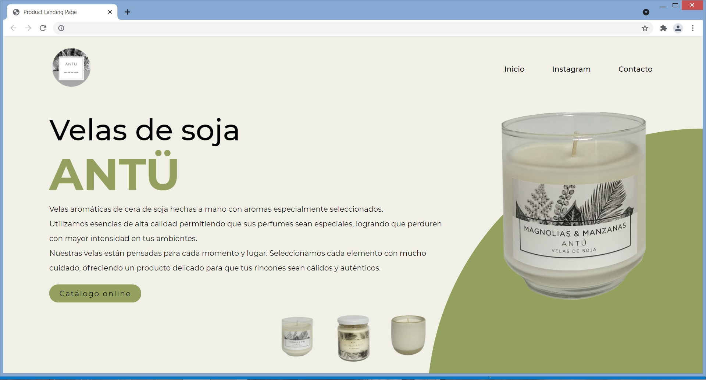

# ANTÜ website: project overview
* Developed a website for a brand.

## Resources Used
&nbsp;
&nbsp; 
&nbsp;

## ANTÜ website
This is a landing page to show the products and the different resources of a brand. It is a combination of the aesthetics of the brand and my design. It is responsive, interactive and has the key links to be redirected. I worked with this brand before when designing the catalog and the digital illustrations for the Instagram account.

